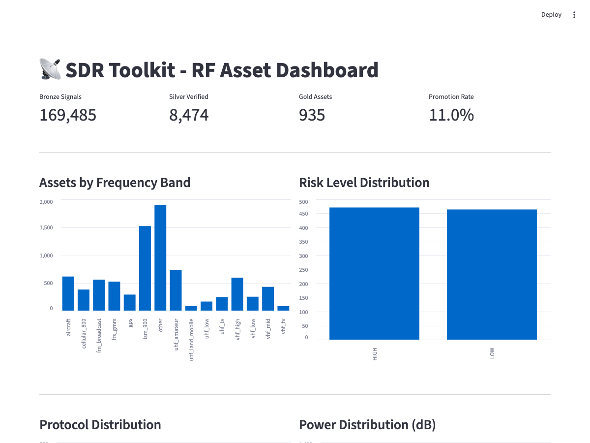
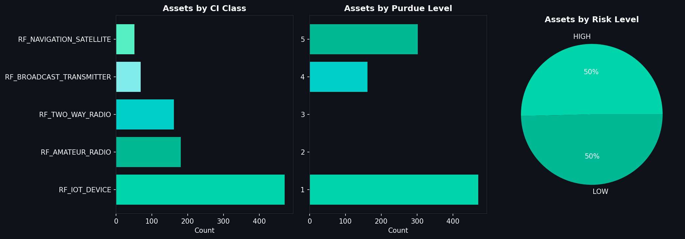
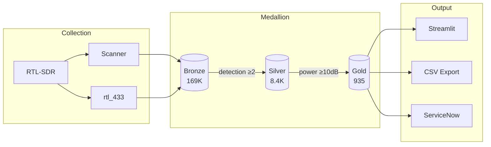

# SDR Toolkit

Production-quality RF signal processing with medallion architecture for OT/IoT security monitoring.

## Problem Statement

Identifies unknown wireless devices in industrial environments through passive RF spectrum analysis. Classifies assets by protocol, risk level, and CMDB CI class for integration with enterprise asset management systems.

## Key Results

| Metric | Value |
|--------|-------|
| Signals Collected | 169,485 |
| Verified (multi-detection) | 8,474 |
| RF Assets Identified | 935 |
| Test Coverage | 305 tests |

## Dashboard



*Streamlit dashboard showing medallion layer metrics, band distribution, and top signals*

## Asset Classification



*Assets classified by CMDB CI Class, Purdue Level, and Risk Level*

## Architecture



## Features

- **Spectrum Scanning**: 24 MHz - 1.7 GHz coverage (RTL-SDR range)
- **Medallion Architecture**: Bronze → Silver → Gold data pipeline
- **CMDB Integration**: ServiceNow-ready asset classification (Purdue Model, risk levels)
- **IoT Discovery**: rtl_433 protocol decoding (TPMS, weather stations, remotes)
- **Claude Code Skills**: 9 agentic commands for autonomous operation

## Quick Start

```bash
# Install dependencies
brew install rtl-sdr rtl_433
uv sync --all-extras
export DYLD_LIBRARY_PATH=/opt/homebrew/lib

# Run spectrum scan
uv run sdr-scan --fm

# Run dashboard
uv run streamlit run dashboard.py
```

## CLI Commands

| Command | Description | Example |
|---------|-------------|---------|
| `sdr-scan` | Spectrum scanner | `sdr-scan --fm` `sdr-scan -s 433 -e 435` |
| `sdr-survey` | Multi-segment survey | `sdr-survey create "Full"` |
| `sdr-transform` | Medallion pipeline | `sdr-transform full` |
| `sdr-iot` | IoT discovery | `sdr-iot -f 433.92M -d 300` |
| `sdr-watch` | Autonomous monitor | `sdr-watch --band aircraft` |
| `sdr-fm` | FM radio playback | `sdr-fm -f 101.9` |
| `sdr-am` | AM/aircraft radio | `sdr-am -f 119.1` |

## Python API

```python
from sdr_toolkit.storage import UnifiedDB
from sdr_toolkit.apps.survey import SurveyManager

with UnifiedDB("data/unified.duckdb") as db:
    manager = SurveyManager(db)
    survey = manager.create_adhoc_survey(
        name="FM Scan",
        start_hz=87.5e6,
        end_hz=108e6,
    )
```

## Documentation

| Document | Description |
|----------|-------------|
| [Architecture](docs/ARCHITECTURE.md) | System design with mermaid diagrams |
| [Medallion Pattern](docs/MEDALLION-PATTERN.md) | Bronze/Silver/Gold pipeline |
| [Results Summary](docs/RESULTS-SUMMARY.md) | Data analysis and metrics |
| [Lessons Learned](docs/LESSONS-LEARNED.md) | Development insights |

## Project Structure

```
src/sdr_toolkit/
├── apps/       # Scanner, recorder, survey, transform
├── decoders/   # ADS-B, IoT (rtl_433)
├── storage/    # DuckDB, Delta Lake, models
├── dsp/        # FFT, demodulation, filters
└── cli/        # Typer CLI

dashboard.py    # Streamlit visualization
exports/        # CSV exports
```

## Development

```bash
DYLD_LIBRARY_PATH=/opt/homebrew/lib pytest tests/ -v  # 305 tests
ruff check src/
mypy src/
```

## Legal

**Receive-only.** RTL-SDR devices operate in receive mode only—no transmission capability. Users are responsible for compliance with local RF monitoring regulations. Educational and authorized security research use only.

## License

MIT - See [LICENSE](LICENSE)
