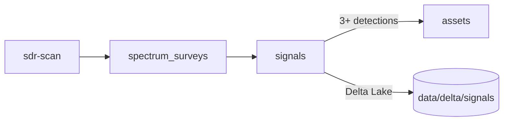

# SDR Toolkit

RTL-SDR toolkit with survey-first storage and agentic monitoring.

## Quick Start

```bash
brew install rtl-sdr rtl_433 && uv sync --all-extras
export DYLD_LIBRARY_PATH=/opt/homebrew/lib
uv run sdr-scan --fm
```

## CLI

| Command | Description | Example |
|---------|-------------|---------|
| `sdr-scan` | Spectrum scanner | `sdr-scan --fm` `sdr-scan -s 433 -e 435` |
| `sdr-survey` | Multi-segment survey | `sdr-survey create "Full"` `sdr-survey resume <id>` |
| `sdr-record` | IQ/audio recorder | `sdr-record -f 101.9 -d 30` |
| `sdr-iot` | IoT discovery | `sdr-iot -f 433.92M -d 300` |
| `sdr-watch` | Autonomous monitor | `sdr-watch --band aircraft` |
| `sdr-fm` | FM playback | `sdr-fm -f 101.9` |
| `sdr-am` | AM/aircraft | `sdr-am -f 119.1` |

## Python API

```python
from sdr_toolkit.storage import UnifiedDB, Signal, SignalState
from sdr_toolkit.apps.survey import SurveyManager

with UnifiedDB("data/unified.duckdb") as db:
    manager = SurveyManager(db)

    # Create survey
    survey = manager.create_adhoc_survey(
        name="FM Scan",
        start_hz=87.5e6,
        end_hz=108e6,
        location_name="NYC Office",
    )

    # Record signal
    signal = Signal(
        survey_id=survey.survey_id,
        frequency_hz=101.9e6,
        power_db=-25.0,
        location_name="NYC Office",
        year=2025,
        month=12,
    )
    db.record_signal(signal)

    # Promote to asset after 3+ detections
    manager.update_signal_state(signal.signal_id, SignalState.PROMOTED)
```

## Schema



| Table | Purpose |
|-------|---------|
| `signals` | All RF detections with lifecycle (discovered → promoted) |
| `spectrum_surveys` | Survey orchestration |
| `survey_segments` | Segment definitions |
| `assets` | Canonical CMDB inventory |
| `scan_sessions` | Audit log |

**Partition:** `location_name/year/month` with Delta Lake time travel.

## Project Structure

```
src/sdr_toolkit/
├── apps/       # Scanner, recorder, survey, FM/AM
├── decoders/   # ADS-B, IoT (rtl_433)
├── storage/    # DuckDB, Delta Lake, models
├── dsp/        # FFT, demodulation, filters
├── io/         # SigMF, audio
└── cli/        # Typer CLI

adws/           # Agentic workflows (spectrum watch)
specs/          # Implementation specs
examples/       # Usage examples
```

## Development

```bash
DYLD_LIBRARY_PATH=/opt/homebrew/lib pytest tests/ -v  # 305 tests
ruff check src/
mypy src/
```

## License

MIT
