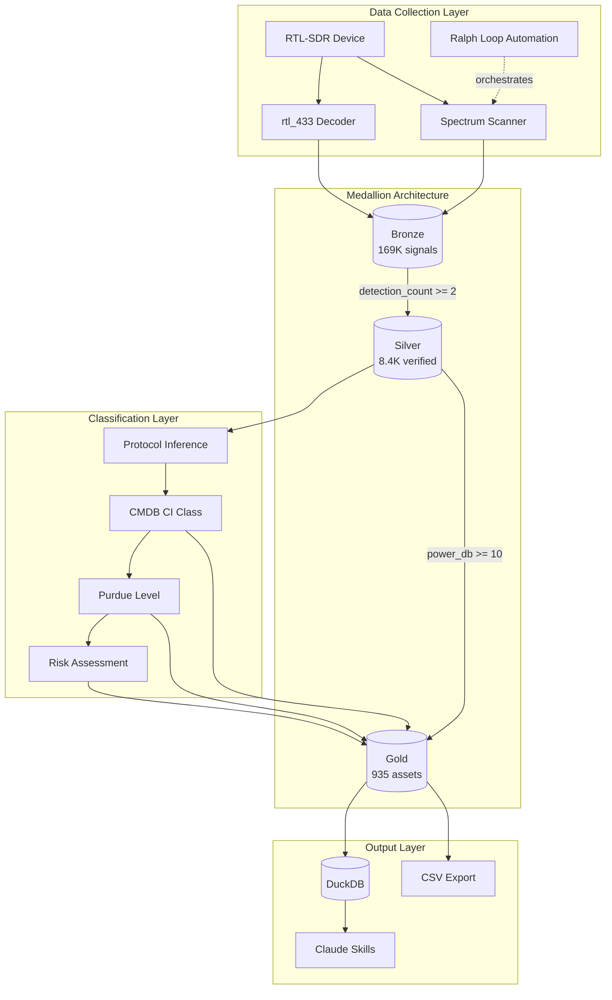
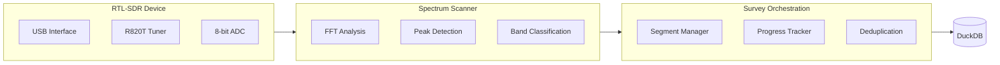
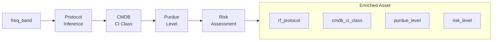

# SDR Toolkit Architecture

## System Overview



## Data Flow

```
RTL-SDR → Scanner → Bronze (raw) → Silver (verified) → Gold (CMDB-ready)
                         ↓              ↓                    ↓
                    169K signals    8.4K multi-det       935 assets
```

## Layer Contracts

| Layer | Schema | Quality Gate | Enrichments |
|-------|--------|--------------|-------------|
| Bronze | `bronze` | None (all data) | freq_band, location_name |
| Silver | `silver` | detection_count ≥ 2, known band | rf_protocol |
| Gold | `gold` | power_db ≥ 10, known protocol | cmdb_ci_class, purdue_level, risk_level |

## Component Details

### Collection Layer



**Key Files:**
- `src/sdr_toolkit/core/device.py` - RTL-SDR context manager
- `src/sdr_toolkit/apps/scanner.py` - Spectrum scanning
- `src/sdr_toolkit/apps/survey/` - Survey orchestration

### Medallion Layer

```mermaid
flowchart TB
    subgraph Bronze["Bronze Layer"]
        signals[signals<br/>169K rows]
        sessions[scan_sessions<br/>7 rows]
        segments[survey_segments<br/>408 rows]
    end

    subgraph Silver["Silver Layer"]
        verified[verified_signals<br/>8.4K rows]
        inventory[band_inventory<br/>20 rows]
    end

    subgraph Gold["Gold Layer"]
        assets[rf_assets<br/>935 rows]
    end

    signals -->|WHERE detection_count >= 2<br/>AND freq_band NOT IN ('unknown', 'gap')| verified
    signals -->|GROUP BY freq_band| inventory
    verified -->|WHERE power_db >= 10<br/>+ CMDB enrichment| assets
```

**Key Files:**
- `src/sdr_toolkit/apps/transform.py` - MedallionTransformer class
- `src/sdr_toolkit/storage/classification.py` - Protocol/CMDB mapping

### Classification Layer



**Classification Mapping:**

| freq_band | rf_protocol | cmdb_ci_class | purdue_level | risk_level |
|-----------|-------------|---------------|--------------|------------|
| fm_broadcast | FM_BROADCAST | RF_BROADCAST | 5 | LOW |
| ism_900 | FSK | RF_IOT_DEVICE | 1 | HIGH |
| aircraft | AM_VOICE | RF_AVIATION | 5 | LOW |
| frs_gmrs | FM_VOICE | RF_TWO_WAY_RADIO | 4 | LOW |

## Database Schema

### Bronze Tables

```sql
-- All raw RF detections
CREATE TABLE bronze.signals (
    signal_id VARCHAR PRIMARY KEY,
    frequency_hz DOUBLE,
    power_db DOUBLE,
    bandwidth_hz DOUBLE,
    freq_band VARCHAR,
    detection_count INTEGER DEFAULT 1,
    state VARCHAR DEFAULT 'discovered',
    first_seen TIMESTAMP,
    last_seen TIMESTAMP,
    survey_id VARCHAR,
    segment_id VARCHAR,
    location_name VARCHAR,
    year INTEGER,
    month INTEGER
);

-- Operation audit log
CREATE TABLE bronze.scan_sessions (
    scan_id VARCHAR PRIMARY KEY,
    scan_type VARCHAR,
    start_time TIMESTAMP,
    end_time TIMESTAMP,
    parameters JSON,
    results_summary JSON
);
```

### Silver Tables

```sql
-- Verified signals (multi-detected)
CREATE TABLE silver.verified_signals AS
SELECT *,
    CASE freq_band
        WHEN 'fm_broadcast' THEN 'FM_BROADCAST'
        WHEN 'ism_900' THEN 'FSK'
        WHEN 'aircraft' THEN 'AM_VOICE'
        -- ... more mappings
    END AS rf_protocol
FROM bronze.signals
WHERE detection_count >= 2
  AND freq_band NOT IN ('unknown', 'gap');

-- Band aggregation
CREATE TABLE silver.band_inventory AS
SELECT freq_band,
       COUNT(*) as signal_count,
       AVG(power_db) as avg_power_db,
       MAX(power_db) as max_power_db
FROM bronze.signals
WHERE freq_band IS NOT NULL
GROUP BY freq_band;
```

### Gold Tables

```sql
-- CMDB-ready assets
CREATE TABLE gold.rf_assets AS
SELECT
    gen_random_uuid()::VARCHAR AS id,
    CONCAT(freq_band, '_', ROUND(frequency_hz/1e6, 1), 'MHz') AS name,
    'RF_EMITTER' AS asset_type,
    frequency_hz AS rf_frequency_hz,
    power_db AS rf_signal_strength_db,
    rf_protocol,
    -- CMDB classification
    CASE freq_band
        WHEN 'ism_900' THEN 'RF_IOT_DEVICE'
        WHEN 'fm_broadcast' THEN 'RF_BROADCAST_TRANSMITTER'
        -- ...
    END AS cmdb_ci_class,
    -- Purdue level (ISA-95)
    CASE freq_band
        WHEN 'ism_900' THEN 1
        WHEN 'fm_broadcast' THEN 5
        -- ...
    END AS purdue_level,
    -- Risk assessment
    CASE
        WHEN purdue_level <= 1 THEN 'HIGH'
        WHEN rf_protocol = 'UNKNOWN' THEN 'MEDIUM'
        ELSE 'LOW'
    END AS risk_level
FROM silver.verified_signals
WHERE power_db >= 10;
```

## CLI Commands

| Command | Purpose | Key Options |
|---------|---------|-------------|
| `sdr-scan` | Spectrum scanning | `--fm`, `--aircraft`, `-s/-e` range |
| `sdr-survey` | Survey orchestration | `create`, `next`, `status`, `resume` |
| `sdr-transform` | Medallion pipeline | `status`, `bronze`, `silver`, `gold`, `full` |
| `sdr-iot` | IoT discovery | `-f 433.92M,315M`, `--duration` |
| `sdr-fm` | FM radio | `-f 101.9` |
| `sdr-watch` | Monitoring | `--band`, `--alert-threshold` |

## Claude Skills

| Skill | Trigger | Purpose |
|-------|---------|---------|
| `/prime` | Session start | Context priming |
| `/survey` | Data collection | Spectrum survey |
| `/transform` | Data processing | Medallion pipeline |
| `/iot` | Device discovery | rtl_433 scanning |
| `/watch` | Monitoring | Alert-based monitoring |

## Technology Stack

| Component | Technology | Purpose |
|-----------|------------|---------|
| Database | DuckDB | Embedded analytics |
| CLI | Typer | Command-line interface |
| SDR | pyrtlsdr | RTL-SDR control |
| IoT | rtl_433 | Protocol decoding |
| Automation | Ralph Loop | Autonomous execution |

## Directory Structure

```
sdr-toolkit/
├── src/sdr_toolkit/
│   ├── apps/           # Scanner, recorder, transform
│   ├── core/           # Device management
│   ├── decoders/       # IoT, ADS-B
│   ├── storage/        # DuckDB, classification
│   └── cli/            # Typer CLI
├── .claude/
│   ├── CLAUDE.md       # Dev instructions
│   ├── commands/       # Skill definitions
│   └── skills/         # Reference docs
├── data/
│   └── unified.duckdb  # Persistent storage
├── exports/
│   └── rf_assets.csv   # Gold layer export
└── docs/               # This documentation
```
