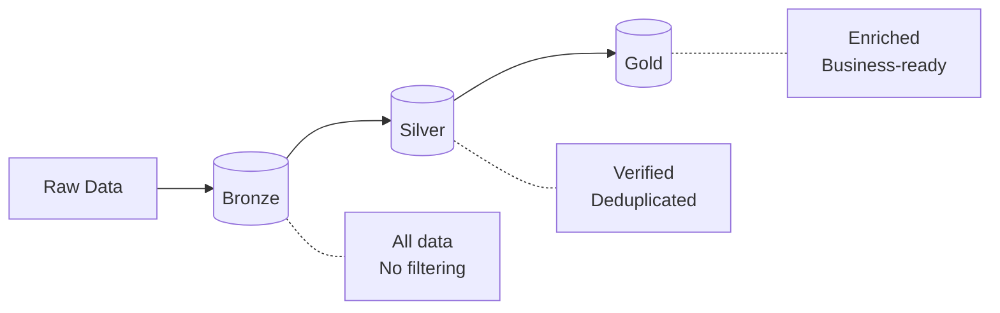

# Medallion Architecture Pattern

Reusable data lakehouse pattern for Claude-agentic projects.

## Pattern Overview



## Core Components

### 1. TransformResult (Domain-Agnostic)

```python
from dataclasses import dataclass

@dataclass
class TransformResult:
    """Result of a medallion transformation."""
    layer: str              # "bronze", "silver", "gold"
    table: str              # Target table name
    rows_created: int       # Output row count
    rows_source: int        # Input row count
    duration_seconds: float # Performance tracking
    success: bool
    error: str | None = None
```

### 2. MedallionTransformer Base

```python
from pathlib import Path
import duckdb

class MedallionTransformer:
    """Base class for medallion transformations."""

    def __init__(self, db_path: Path | str, read_only: bool = False):
        self.db_path = Path(db_path)
        self.read_only = read_only
        self._conn = None

    def __enter__(self):
        self.connect()
        return self

    def __exit__(self, *args):
        self.close()

    def connect(self):
        self._conn = duckdb.connect(str(self.db_path), read_only=self.read_only)

    def close(self):
        if self._conn:
            self._conn.close()
            self._conn = None

    @property
    def conn(self):
        if self._conn is None:
            raise RuntimeError("Not connected. Use context manager.")
        return self._conn

    def create_schemas(self) -> dict[str, bool]:
        """Create bronze, silver, gold schemas."""
        results = {}
        for schema in ["bronze", "silver", "gold"]:
            try:
                self.conn.execute(f"CREATE SCHEMA IF NOT EXISTS {schema}")
                results[schema] = True
            except Exception as e:
                results[schema] = False
        return results

    def get_status(self) -> dict:
        """Get table counts per layer."""
        # Implementation in subclass
        pass

    def run_full_pipeline(self, **kwargs) -> list[TransformResult]:
        """Run complete transformation pipeline."""
        # Implementation in subclass
        pass
```

### 3. Classification Registry Pattern

```python
from dataclasses import dataclass
from typing import Dict

@dataclass
class ClassInfo:
    """Classification metadata for a category."""
    protocol: str
    cmdb_class: str
    purdue_level: int
    risk_default: str

# Domain-specific mapping (replace with your domain)
DOMAIN_MAP: Dict[str, ClassInfo] = {
    "category_a": ClassInfo("PROTO_A", "CMDB_CLASS_A", 1, "HIGH"),
    "category_b": ClassInfo("PROTO_B", "CMDB_CLASS_B", 3, "MEDIUM"),
    "category_c": ClassInfo("PROTO_C", "CMDB_CLASS_C", 5, "LOW"),
}

def generate_case_sql(mapping: dict, input_col: str, output_field: str) -> str:
    """Generate SQL CASE statement from mapping dictionary."""
    cases = []
    for key, info in mapping.items():
        value = getattr(info, output_field)
        if isinstance(value, str):
            cases.append(f"WHEN '{key}' THEN '{value}'")
        else:
            cases.append(f"WHEN '{key}' THEN {value}")

    return f"CASE {input_col}\n    " + "\n    ".join(cases) + "\n    ELSE 'UNKNOWN'\nEND"
```

### 4. Layer Transformation Template

```python
def bronze_to_silver(
    self,
    min_threshold: float = 0,
    min_count: int = 2,
    exclude_categories: list[str] | None = None,
    dry_run: bool = False,
) -> TransformResult:
    """Transform bronze to silver layer."""
    from datetime import datetime
    start_time = datetime.now()

    exclude_categories = exclude_categories or ["unknown"]
    exclude_list = ", ".join(f"'{c}'" for c in exclude_categories)

    sql = f"""
        SELECT *,
            {PROTOCOL_CASE_SQL} AS inferred_protocol
        FROM bronze.raw_data
        WHERE metric_value >= {min_threshold}
          AND detection_count >= {min_count}
          AND category NOT IN ({exclude_list})
    """

    try:
        source_count = self.conn.execute(f"SELECT COUNT(*) FROM ({sql}) sub").fetchone()[0]

        if dry_run:
            return TransformResult(
                layer="silver", table="verified_data",
                rows_created=0, rows_source=source_count,
                duration_seconds=(datetime.now() - start_time).total_seconds(),
                success=True, error="DRY RUN"
            )

        self.create_schemas()
        self.conn.execute("DROP TABLE IF EXISTS silver.verified_data")
        self.conn.execute(f"CREATE TABLE silver.verified_data AS {sql}")

        result_count = self.conn.execute("SELECT COUNT(*) FROM silver.verified_data").fetchone()[0]

        return TransformResult(
            layer="silver", table="verified_data",
            rows_created=result_count, rows_source=source_count,
            duration_seconds=(datetime.now() - start_time).total_seconds(),
            success=True
        )
    except Exception as e:
        return TransformResult(
            layer="silver", table="verified_data",
            rows_created=0, rows_source=0,
            duration_seconds=(datetime.now() - start_time).total_seconds(),
            success=False, error=str(e)
        )
```

## Adaptation Checklist

### Step 1: Define Domain Enums

```python
from enum import Enum

class YourProtocol(str, Enum):
    """Domain-specific protocol classification."""
    TYPE_A = "type_a"
    TYPE_B = "type_b"
    UNKNOWN = "unknown"

class YourCMDBClass(str, Enum):
    """ServiceNow CMDB CI class mappings."""
    CLASS_A = "cmdb_ci_class_a"
    CLASS_B = "cmdb_ci_class_b"
```

### Step 2: Create Classification Map

```python
DOMAIN_MAP = {
    "input_category_1": ClassInfo(
        protocol="TYPE_A",
        cmdb_class="cmdb_ci_class_a",
        purdue_level=1,
        risk_default="HIGH"
    ),
    # Add more mappings...
}
```

### Step 3: Define Quality Gates

| Layer | Gate | Example |
|-------|------|---------|
| Bronze | None | All raw data |
| Silver | Multi-occurrence + known category | `detection_count >= 2 AND category != 'unknown'` |
| Gold | High quality + enrichment | `metric >= threshold AND protocol != 'UNKNOWN'` |

### Step 4: Implement Transformations

```python
class MyDomainTransformer(MedallionTransformer):
    def bronze_to_silver(self, **kwargs) -> TransformResult:
        # Silver transformation logic
        pass

    def silver_to_gold(self, **kwargs) -> TransformResult:
        # Gold transformation logic with CMDB enrichment
        pass

    def run_full_pipeline(self, **kwargs) -> list[TransformResult]:
        results = []
        results.append(self.bronze_to_silver(**kwargs))
        results.append(self.silver_to_gold(**kwargs))
        return results
```

### Step 5: Add CLI Commands

```python
import typer

app = typer.Typer()

@app.command()
def transform(
    command: str = typer.Argument(..., help="status|bronze|silver|gold|full"),
    db: str = typer.Option("data/unified.duckdb", "--db"),
    dry_run: bool = typer.Option(False, "--dry-run"),
):
    """Medallion transformation commands."""
    with MyDomainTransformer(db) as transformer:
        if command == "status":
            print(transformer.get_status())
        elif command == "full":
            results = transformer.run_full_pipeline(dry_run=dry_run)
            for r in results:
                print(f"{r.layer}.{r.table}: {r.rows_created} rows")
```

### Step 6: Create Claude Skill

```markdown
# .claude/commands/transform.md

# Transform Skill

Transform data through medallion architecture.

## Commands

\`\`\`bash
uv run my-transform status    # Show pipeline status
uv run my-transform bronze    # Migrate to bronze
uv run my-transform silver    # Transform bronze → silver
uv run my-transform gold      # Transform silver → gold
uv run my-transform full      # Run complete pipeline
\`\`\`
```

## Best Practices

### 1. Idempotent Transforms

```python
# Always drop before create
self.conn.execute("DROP TABLE IF EXISTS silver.verified_data")
self.conn.execute(f"CREATE TABLE silver.verified_data AS {sql}")
```

### 2. Lineage Tracking

```python
# Include source IDs in gold layer
SELECT
    source_id,           -- Link to silver
    -- enriched fields
FROM silver.verified_data
```

### 3. Dry Run Support

```python
def transform(self, dry_run: bool = False):
    if dry_run:
        return TransformResult(..., error="DRY RUN - no changes")
    # Actual transformation
```

### 4. Context Managers

```python
# Always use context managers for connections
with MedallionTransformer(db_path) as transformer:
    transformer.run_full_pipeline()
```

### 5. Checkpoint Commits

```bash
# Commit after each major transformation
git add data/unified.duckdb
git commit -m "Data: bronze layer complete"
```

## Example: SDR Toolkit Implementation

| Component | SDR-Specific | Generic Pattern |
|-----------|--------------|-----------------|
| Bronze table | `signals` | `raw_data` |
| Silver table | `verified_signals` | `verified_data` |
| Gold table | `rf_assets` | `assets` |
| Classification | freq_band → rf_protocol | category → protocol |
| Quality gate | detection_count >= 2 | occurrence >= threshold |
| Enrichment | CMDB CI class, Purdue level | Domain-specific fields |

## Files to Create

```
your-project/
├── src/your_project/
│   ├── apps/
│   │   └── transform.py      # MedallionTransformer subclass
│   └── storage/
│       ├── classification.py # Domain mapping
│       └── models.py         # Domain enums
├── .claude/
│   ├── CLAUDE.md             # Dev instructions
│   └── commands/
│       └── transform.md      # Transform skill
└── data/
    └── unified.duckdb        # Persistent storage
```
